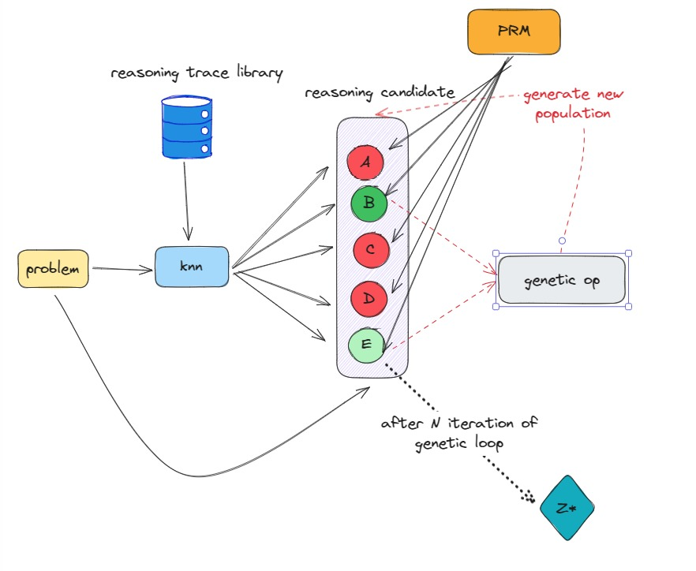

# 🦅 EAGLE - Evolutionary Algorithm Guided by LLM Expertise

**EAGLE** is an evolutionary reasoning framework that combines the power of Large Language Models (LLMs) with genetic algorithms to solve complex problems. It leverages a semantic index of reasoning traces and uses a Process Reward Model (PRM) to guide the evolution toward optimal solutions.

## 🚀 Features

- 🔍 **Similarity Search (KNN)**: Retrieves the most relevant reasoning traces for a given problem.
- 🧬 **Genetic Evolution**: Uses mutation, crossover, and selection to generate new solutions.
- 🏆 **PRM-Based Evaluation**: A reward function that guides the improvement of solutions.
- ⚡ **Fast Convergence**: Accelerated convergence using optimized semantic embeddings.

## 📚 Architecture
[](resources/eagle_000.jpg)


## 📦 Installation

Clone the repository and install dependencies:

```bash
git clone git@github.com:milkymap/eagle.git
cd eagle
python3.10 -m venv env 
source env/bin/activate
pip install -r requirements.txt
```


